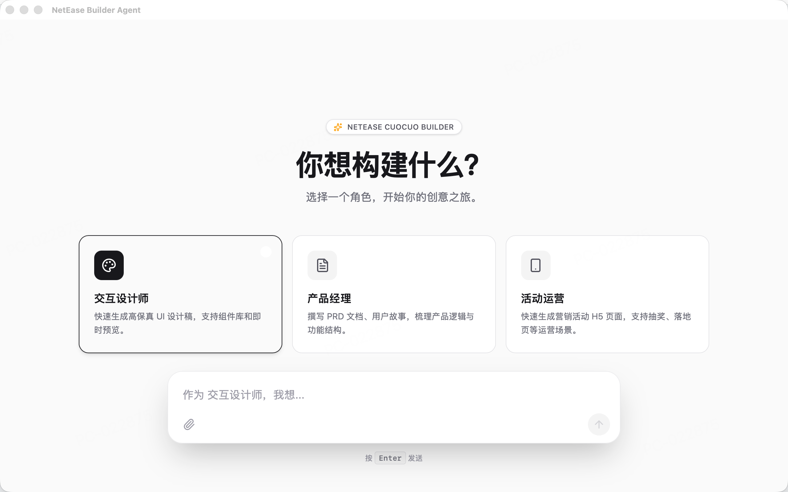

# Builder Agent

A simple builder agent demo using Tauri and Gemini API.

## Run and deploy your AI Studio app

This contains everything you need to run your app locally.

View your app in AI Studio: https://ai.studio/apps/8bacfed9-87c0-477b-913a-209ca0c3292a

## Run Locally

**Prerequisites:** Node.js

1. Install dependencies:
   `npm install`
2. Set the `GEMINI_API_KEY` in [.env.local](.env.local) to your Gemini API key
3. Run the app:
   `npm run dev`
